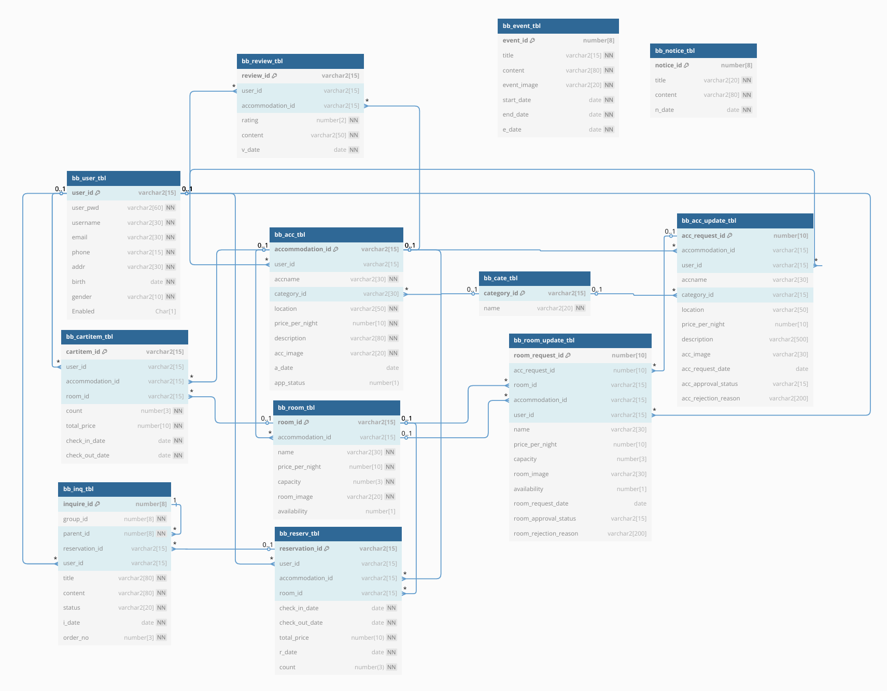

# 🏨 StayEasy
숙박 예약 웹 애플리케이션
## 🔗 프로젝트 링크
- [StayEasy 웹 링크](http://stayeasy.kro.kr)
- [보고서 PDF](./screenshots/StayEasy.pdf)

---

## 📌 프로젝트 개요

**StayEasy**는 사용자가 편리하게 숙소를 검색하고 예약할 수 있는 웹 기반 애플리케이션입니다.  
관리자는 사용자 정보와 예약 내역을 확인 및 관리할 수 있으며, 전체 숙소 리스트를 효율적으로 운영할 수 있습니다.  
(프로젝트의 화면 사진은 PDF파일에 첨부되어 있습니다.)

이 프로젝트는 웹 개발에 대한 이해를 높이고 Spring Framework, JDBC, Mybatis, JPA, JSP, Oracle 등 다양한 기술 스택을 실습하기 위해 진행되었습니다.

- **개발 기간**: 2024.02.10 ~ 2025.03.28  
- **훈련 과정**: 클라우드 기반 웹 개발 (보안 코딩)  
- **팀 이름**: 방방곡곡  
- **팀원**: 최영찬(팀장), 이승준, 김용우, 한민주

---

## 🛠️ 사용 기술

| 구분 | 기술 스택 |
|------|-----------|
| Backend | Java 21, Spring Framework, Spring JDBC / MyBatis, JSP, JSTL |
| Frontend | HTML, CSS, JavaScript |
| Database | Oracle 11g |
| 개발 환경 | Spring Tool Suite (STS), Apache Tomcat v9.0 |
| 협업 도구 | SVN |
| 배포 | AWS EC2 |

 

**기술 포인트**
- Spring MVC 구조를 기반으로 컨트롤러-서비스-DAO 계층을 분리하여 유지보수가 용이한 구조로 설계
- MyBatis를 사용해 SQL을 XML로 분리하고, 복잡한 조인문을 효율적으로 처리
- JavaMailSender를 이용한 임시 비밀번호 메일 전송 구현
- 사용자 비밀번호는 PBKDF2 해시 알고리즘을 적용하여 보안 강화
- AWS EC2 서버에 배포하여 실제 서비스 환경과 유사하게 구축

---

## 📂 주요 기능

#### 🧾 예약 흐름
1. 숙소 검색 → 상세 보기
2. 인원 및 일정 선택 → 장바구니 담기 or 바로 예약
3. 마이페이지에서 예약 내역 확인 및 취소 가능
4. 숙박 후 리뷰 작성 가능

#### 🔑 회원 기능
- 회원가입 (ID 중복체크)
- 로그인 / 로그아웃
- 아이디 / 비밀번호 찾기 (임시 비밀번호 이메일 발송)
- 마이페이지 (회원 정보 수정)
- 내 예약 목록 확인 및 취소
- 예약 관련 문의 작성 및 확인
- 장바구니 기능

#### 🏨 숙소 기능
- 숙소 검색 및 필터링
- 숙소 카테고리 선택 (호텔, 모텔, 펜션, 캠핑 등)
- 숙소 상세 정보 확인
- 숙소 및 인원 선택 후 예약
- 숙소 리뷰 작성
- 내 숙소 등록 신청 및 수정 신청

### 🔧 관리자 기능
- 공지사항 / 이벤트 작성 및 수정
- 사용자 ID로 정보 조회 (예약, 문의, 숙소 포함)
- 사용자 문의에 답변 작성
- 숙소 신청 승인 / 거절

#### 💬 기타
- 공지사항 게시판
- 이벤트 게시판
- 1:1 문의 작성 및 확인

---

## 👨‍👩‍👧‍👦 팀원 및 역할

| 이름 | 역할 |
|-------|------|
| **최영찬 (본인)** | 팀장, 회원가입/로그인/장바구니/예약/문의 기능 전체 구현,   비밀번호 보안(해싱), 이메일 인증(임시 비밀번호 발송), 배포(AWS EC2), 프론트 유효성 검사 |
| 김용우 | DB설계, 공지사항 페이지, 숙소 검색 및 필터 기능, 페이징 처리, 숙소 리뷰 및 평점 |
| 이승준 | 이벤트 페이지, 숙소 및 예약 관리(관리자용) |
| 한민주 | UI/UX 디자인, 마이페이지(회원), 사용자 조회(관리자용) |

---

## 🗃️ 데이터베이스 및 구조

  
 ✴️ ERD 이미지 보기

  

---

